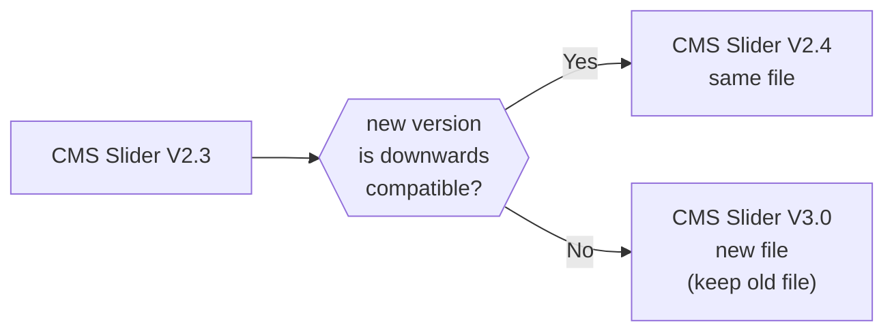

# Library
Public library of scripts and stylesheets for our (Webflow) websites.

To use these files in a (Webflow) project, reference them via `https://wearemomentum.github.io/library/`.

Example: ``

Important note: do NOT use `async` for scripts to be executed before Webflow initialization.

- [Scripts](#scripts)
  - [Naming](#naming)
  - [Versioning](#versioning)
- [Stylesheets](#stylesheets)

## Scripts
A collection of various scripts to implement functionality to our Webflow projects.

Create a md-file for documentation for every script-file.
### Naming
CMS Slider V2.3 -> `cms-slider-v2`

CMS Slider V3.0 -> `cms-slider-v3`
### Versioning
<!-- https://mermaid.js.org/intro/ -->

## Stylesheets
A collection of various stylesheets to add to our Webflow projects.