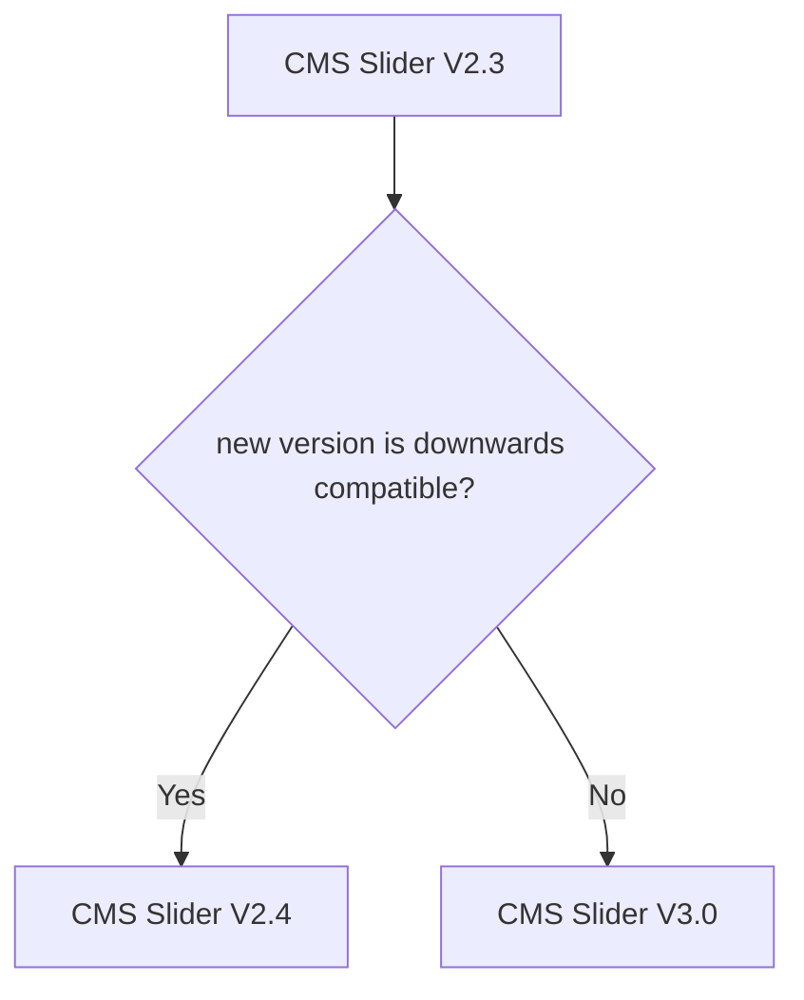

# Library
Public library of scripts, stylesheets and assets for our (Webflow) websites
- [Assets](#assets)
- [Scripts](#scripts)
  - [Naming](#naming)
  - [Versioning](#versioning)
- [Stylesheets](#stylesheets)

## Assets
Webflow is very restrictive in regards to assets. Files that cannot be uploaded to Webflow can be hosted here.

Create a folder for the project (website) and add your files.

## Scripts
A collection of various scripts to implement functionality to our Webflow projects.

Create a md-file for documentation for every script-file.
### Naming
CMS Slider V2.3 -> `cms-slider-v2`
CMS Slider V3.0 -> `cms-slider-v3`
### Versioning
<!-- https://mermaid.js.org/intro/ -->

CMS Slider V2.3 -> new version is downwards compatible? -> V2.4 (same file)

else -> V3.0 (new file: `cms-slider-v3`, keep old file)

## Stylesheets
A collection of various stylesheets to add to our Webflow projects.