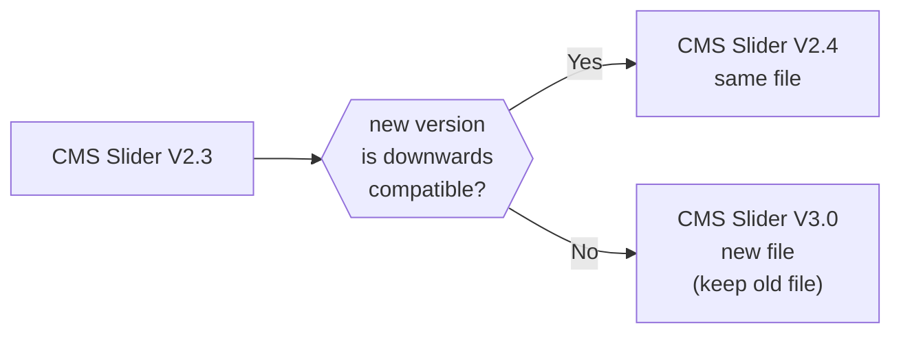

# Library
Public library of scripts and stylesheets for our (Webflow) websites.

- [General](#general)
- [Scripts](#scripts)
- [Stylesheets](#stylesheets)
- [Projects](#projects)

## General
To use these files in a (Webflow) project, reference them via `https://wearemomentum.github.io/library/`.

The following naming and versioning rules ensure that projects always use the newest subversion of a file, without the need to update the filename in every project.

### Naming
CMS Slider V2.3 -> `cms-slider-v2`

CMS Slider V3.0 -> `cms-slider-v3`

### Versioning
<!-- https://mermaid.js.org/intro/ -->

## Scripts
A collection of various scripts to implement functionality to our Webflow projects.

There's a .md documentation for every script.

Example: ``

Important note: do NOT use `async` or `defer` for scripts to be executed before Webflow initialization.

## Stylesheets
A collection of various stylesheets to add to our Webflow projects.

Example: `<link href="https://wearemomentum.github.io/library/stylesheets/general-v0.css" rel="stylesheet" type="text/css">`
